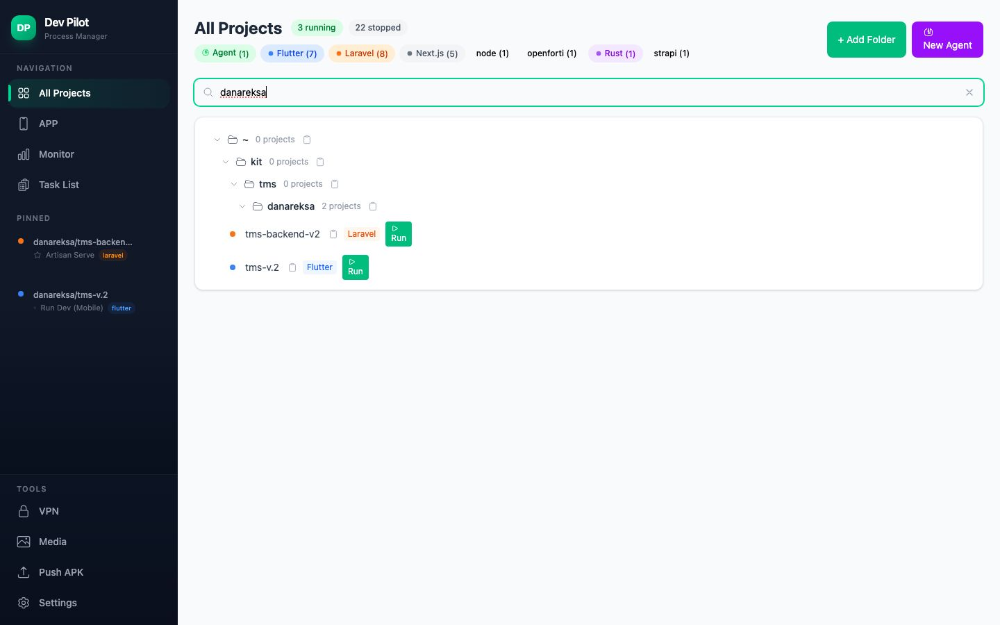
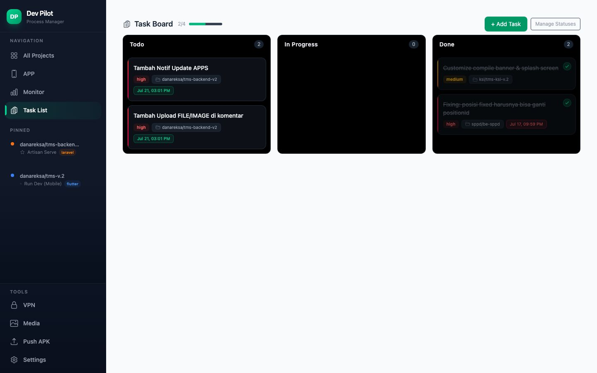
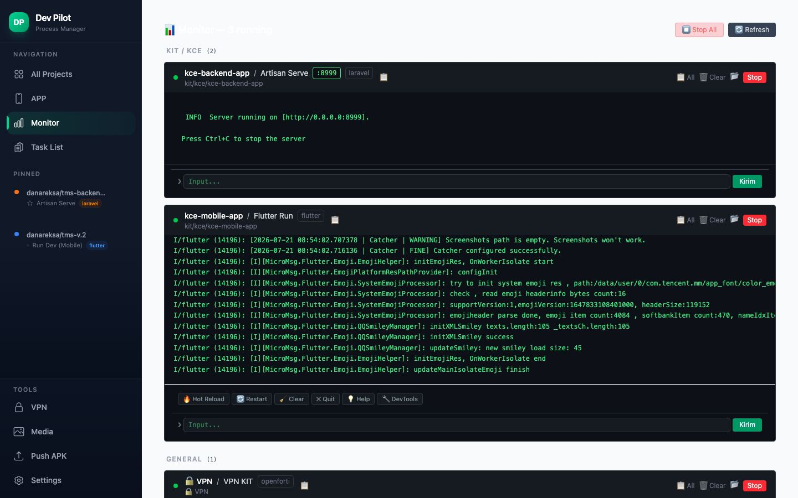
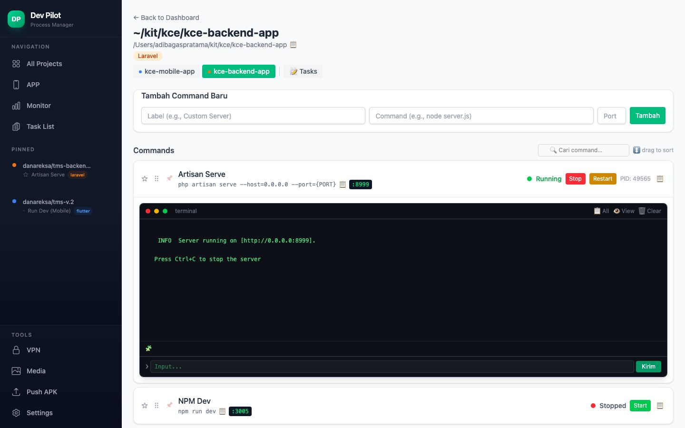
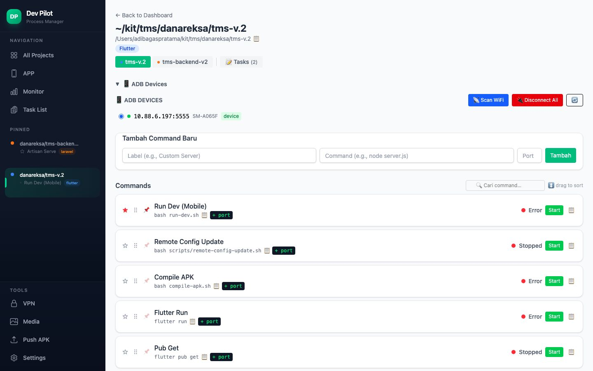
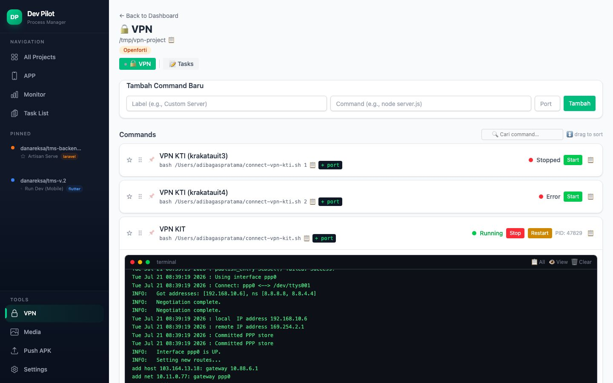
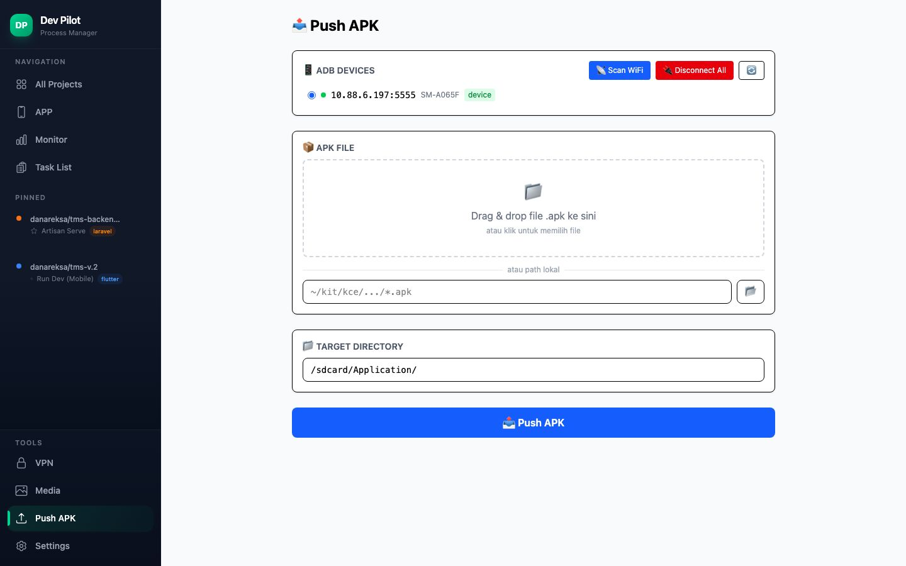
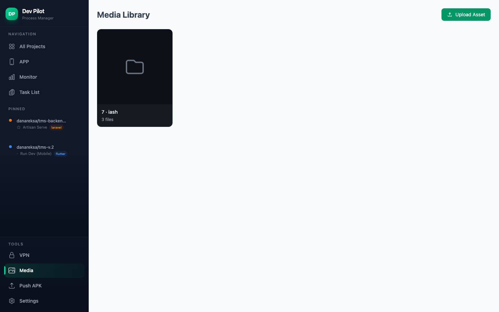

# Dev Pilot 🧑‍✈️

Process manager berbasis web untuk development **Flutter**, **Laravel**, dan **Node.js**.
Jalankan, pantau, dan kirim input ke process development dari satu dashboard — tanpa berpindah-pindah jendela terminal.

[](LICENSE)
[](https://nodejs.org)
[](https://expressjs.com)
[](https://react.dev)
[](https://www.typescriptlang.org)

---

## Tangkapan Layar

### Dashboard — semua project dalam satu halaman

Menampilkan jumlah process yang berjalan/berhenti, dikelompokkan berdasarkan jenis project (Flutter, Laravel, Node, Rust, dan lainnya).



### Papan Tugas (Kanban) — manajemen task per project



### Monitor — terminal langsung untuk semua process berjalan



<details>
<summary>Lihat tangkapan layar lainnya</summary>

| Halaman | Gambar |
|---|---|
| Detail project Laravel (commands + log langsung) |  |
| Detail project Flutter (Flutter Quick Actions) |  |
| Detail project VPN (openfortivpn) |  |
| Push APK ke perangkat Android via ADB |  |
| Pustaka media |  |

</details>

---

## Fitur

- 📋 **Dashboard** — semua project dengan filter kategori, pemindaian folder, dan favorit
- 🚀 **Start / Stop / Restart** — kelola process tiap project, termasuk restart otomatis
- 🖥️ **Terminal langsung** — log real-time dengan auto-scroll dan pencarian
- ⌨️ **Input interaktif** — kirim perintah ke STDIN (`Enter`, `r`, `q`, dan lainnya)
- 🔥 **Flutter Quick Actions** — Hot Reload, Restart, Clear, Quit, Help, DevTools, serta badge perangkat
- 🎯 **Manajemen port** — port sebagai field terpisah, unik, otomatis dibersihkan saat start/stop
- 📊 **Monitor** — semua process berjalan dalam satu layar, lengkap dengan aksi restart dan salin log
- 🗂️ **Papan Tugas (Kanban)** — task per project dengan status, komentar, dan lampiran
- 🖼️ **Pustaka Media** — kumpulan aset gambar/berkas untuk kebutuhan project
- 📱 **Push APK** — kirim berkas `.apk` ke perangkat Android lewat ADB (drag & drop)
- ⚙️ **Remote Config** — sinkronisasi dan publikasi konfigurasi versi ke backend (dev/prod)
- 🔐 **Dukungan VPN** — jalankan skrip `openfortivpn`/`pppd` dan pantau log-nya
- 🔄 **Drag & Drop** — urutkan process dan kartu task
- 📋 **Salin sekali klik** — command, log, dan path

## Stack

| Lapisan | Teknologi |
|---------|-----------|
| Backend | Node.js, Express 5 |
| Frontend | React 19 + Vite + TypeScript |
| UI | Tailwind CSS v4 |
| Database | PostgreSQL (default) atau SQLite, via Knex |
| Process | `child_process` (spawn/kill) + `node --watch` |
| Ikon | Heroicons v2 |

## Persyaratan

- **Node.js >= 22** (memanfaatkan `--env-file-if-exists`)
- **PostgreSQL** (disarankan) atau **SQLite** (`DB_CLIENT=better-sqlite3`, tanpa setup tambahan)
- Opsional: Flutter SDK, PHP/Composer (Laravel), `adb`, `openfortivpn`

## Cara Pakai

### 1. Klon dan pasang dependensi

```bash
git clone https://github.com/adibagasp23/dev-pilot.git
cd dev-pilot

npm install
cd client && npm install && cd ..
```

### 2. Siapkan konfigurasi

```bash
cp .env.example .env
```

Sesuaikan isi `.env` bila perlu. Tabel variabel tersedia di bagian [Konfigurasi](#konfigurasi).

### 3. Siapkan database

Migration berjalan otomatis saat server pertama kali dijalankan. Untuk menjalankannya secara manual:

```bash
npm run migrate
```

Bila memakai PostgreSQL, pastikan database tujuan sudah dibuat terlebih dahulu, contoh:

```bash
createdb process_manager
```

### 4. Jalankan aplikasi

```bash
npm run dev
```

Perintah tersebut menjalankan dua server sekaligus:

- **`http://localhost:5173`** — Vite dev server (frontend, HMR)
- **`http://localhost:9876`** — Express API (backend, auto-restart lewat `node --watch`)

### 5. Konfigurasi folder pemindaian

Buka `http://localhost:5173/settings` lalu tambahkan folder project yang ingin dipindai. Alternatif melalui API:

```bash
curl -X POST http://localhost:9876/api/settings/folders \
  -H "Content-Type: application/json" \
  -d '{"path": "/home/user/projects"}'
```

### 6. Pindai project

Dari dashboard, klik **Scan Folders** untuk mendeteksi project Flutter (`pubspec.yaml`), Laravel (`artisan`), dan Node.js (`package.json`).

### 7. Jalankan process

- Buka halaman project, lalu klik **Start** pada process yang diinginkan
- Terminal terbuka otomatis dan dapat menerima input melalui prompt `❯`
- Untuk Flutter, gunakan tombol **Hot Reload**, **Restart**, dan lainnya
- Klik **Stop** untuk menghentikan process

### 8. Build untuk produksi

```bash
cd client && npm run build && cd ..
npm start
```

Frontend akan disajikan langsung oleh Express pada `http://localhost:9876`.

## Konfigurasi

Seluruh konfigurasi dibaca dari variabel lingkungan (`process.env`). Berkas `.env` dimuat otomatis oleh `npm run dev` dan `npm start`.

| Variabel | Default | Keterangan |
|----------|---------|------------|
| `PORT` | `9876` | Port server Express |
| `DB_CLIENT` | `pg` | `pg` untuk PostgreSQL, `better-sqlite3` untuk SQLite |
| `DB_HOST` | `localhost` | Host PostgreSQL |
| `DB_PORT` | `5432` | Port PostgreSQL |
| `DB_NAME` | `process_manager` | Nama database |
| `DB_USER` | `$USER` | Pengguna database |
| `DB_PASS` | *(kosong)* | Kata sandi database |
| `RC_API_KEY` | *(kosong)* | API key backend Remote Config |
| `RC_BACKEND_URL` | `http://127.0.0.1:8003` | Backend Remote Config lokal |
| `RC_DEV_BACKEND_URL` | `http://127.0.0.1:8003` | Backend Remote Config lingkungan dev |
| `RC_PROD_BACKEND_URL` | — | Backend Remote Config lingkungan prod |
| `RC_DEV_SERVER_BACKEND_URL` | — | Backend Remote Config dev server |

> **Catatan keamanan:** jangan pernah menuliskan API key atau kata sandi langsung di dalam kode. Gunakan `.env` yang sudah masuk `.gitignore`.

## Struktur Folder

```
dev-pilot/
├── client/                  # Frontend React (Vite + TypeScript)
│   ├── src/
│   │   ├── components/      # Komponen UI (Sidebar, KanbanBoard, Icons, dll.)
│   │   ├── pages/           # Dashboard, ProjectDetail, Monitor, Tasks, dll.
│   │   ├── api.ts           # Klien API
│   │   └── types.ts         # Tipe TypeScript
│   └── dist/                # Hasil build (otomatis)
├── database/
│   ├── db.js                # Setup Knex + migrator
│   └── migrations/          # Migration database
├── docs/                    # Dokumentasi, spesifikasi, dan tangkapan layar
├── routes/api.js            # Rute API Express
├── services/                # Logika bisnis (scanner, process manager, backup)
├── config.js                # Konfigurasi
└── index.js                 # Titik masuk Express
```

## API Endpoints

| Metode | Path | Deskripsi |
|--------|------|-----------|
| GET | `/api/projects` | Semua project |
| POST | `/api/projects/scan` | Pindai folder |
| GET | `/api/projects/:id` | Detail project |
| GET | `/api/projects/:id/processes` | Process per project |
| POST | `/api/projects/:id/reorder` | Urutkan process |
| POST | `/api/processes` | Tambah process |
| PUT | `/api/processes/:id` | Perbarui process |
| DELETE | `/api/processes/:id` | Hapus process |
| POST | `/api/processes/:id/start` | Jalankan process |
| POST | `/api/processes/:id/stop` | Hentikan process |
| POST | `/api/processes/:id/input` | Kirim input ke STDIN |
| GET | `/api/processes/:id/log` | Ambil log |
| GET | `/api/processes/:id/log/stream` | Stream log (SSE) |
| POST | `/api/processes/:id/clear-logs` | Bersihkan log |
| GET | `/api/processes/running` | Semua process yang berjalan |
| GET | `/api/processes/recent` | Process terbaru |
| GET | `/api/settings/folders` | Folder pemindaian |
| POST | `/api/settings/folders` | Tambah folder |
| DELETE | `/api/settings/folders/:id` | Hapus folder |
| GET | `/api/tasks` | Daftar task |
| GET | `/api/task-statuses` | Status task |
| GET | `/api/media` | Pustaka media |
| GET | `/api/adb-devices` | Daftar perangkat ADB |
| POST | `/api/push-apk` | Kirim APK ke perangkat |
| GET | `/api/remote-config/templates/:projectId` | Template Remote Config |
| GET | `/api/remote-config/sync/:projectId` | Sinkronisasi Remote Config |

## Kontribusi

Kontribusi terbuka untuk siapa saja. Silakan buat *fork*, lalu ajukan *pull request*.

1. Buat branch fitur: `git checkout -b feat/nama-fitur`
2. Lakukan perubahan dan pastikan build lolos: `cd client && npm run build`
3. Commit dengan pesan yang jelas, lalu push dan buka pull request

## Lisensi

Dirilis di bawah [MIT License](LICENSE) — bebas digunakan, dimodifikasi, dan didistribusikan, termasuk untuk keperluan komersial, selama mencantumkan hak cipta asli.
